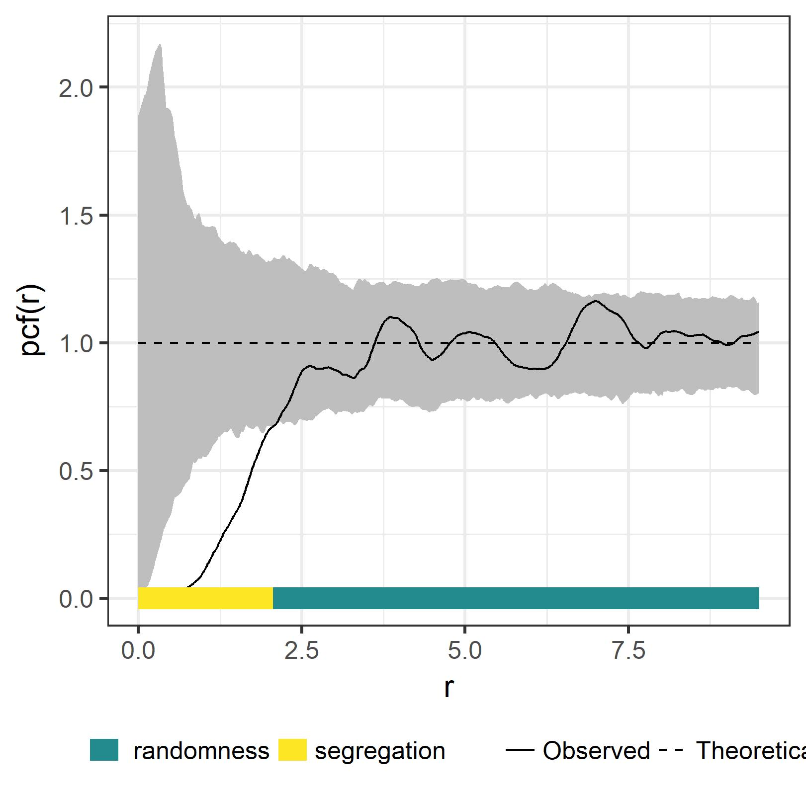
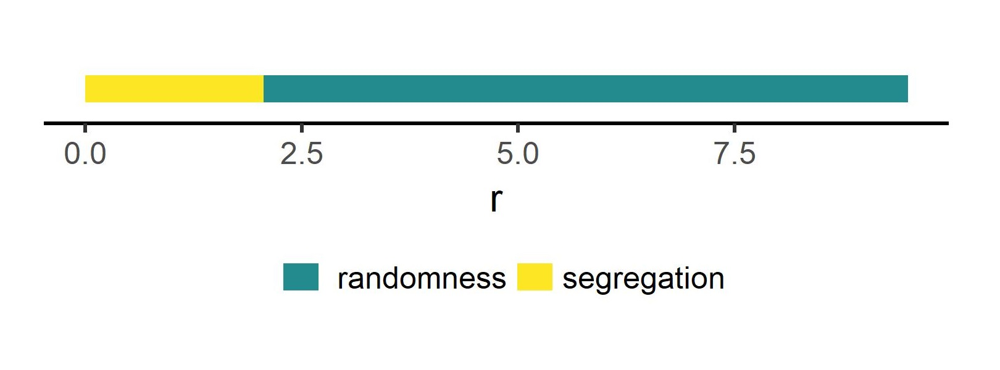

# UtilityFunctions

The package is a growing collection of handy functions. Since I mainly work on point pattern analysis, many are somehow connected to this topic.

### Installing

You can install UtilityFunctions using the following code:

```r
devtools::install_github(repo = 'mhesselbarth/UtilityFunctions')
``` 

## Examples


```r
pp <- spatstat.data::spruces
sim_envel <- spatstat::envelope(Y = pp, fun = pcf, divisor = 'd',
                                nrank = 5, nsim = 499)

result <- Plot.Envelope(input = sim_envel, xlab = 'r', ylab = 'pcf(r)')

result_bars <- Plot.Envelope(input = sim_envel, xlab = 'r', ylab = 'pcf(r)', 
                             full_fun = FALSE)
``` 




``` 
Save.Function.ggplot(plot = result, filename = 'example_plot_full.jpeg')
Save.Function.ggplot(plot = result_bars, filename = 'example_plot_bars.jpeg')
```


### Authors

* **Maximilian H.K. Hesselbarth**

## License

This project is licensed under the GNU3 License - see the [LICENSE](https://github.com/mhesselbarth/UtilityFunctions/blob/master/LICENSE) file for details

## Acknowledgments

Thanks to Daniel Esser for the idea of the simulaten envelope bar plos
